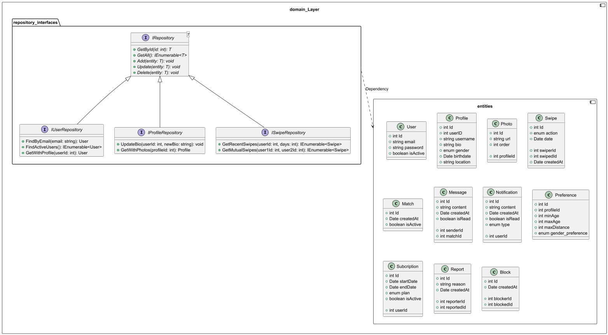
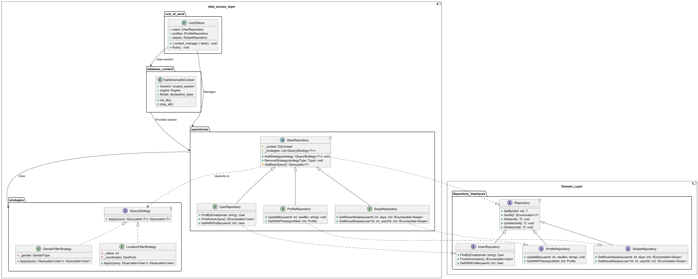

# Thiết kế Dating App Tinder cho IT4409

## 1. Thiết kế kiến trúc

### 1.1. Mô hình kiến trúc

Mô hình kiến trúc của Dating App Tinder được thiết kế theo mô hình Client-Server.
Server được xây dựng với kiến trúc layered architecture, bao gồm các layer: Presentation Layer, Business Layer, Data Access Layer, Domain Layer

Kiến trúc này vẫn có thể mở rộng dễ dàng, có thể thêm các server khác như server chứa dữ liệu, server chứa ảnh, server chứa video, server chứa thông tin người dùng, ...
muốn mở rộng thêm tính năng mới dùng chung có thể thêm một layer mới hoặc một use-case business ở tầng Business Layer.

### 1.2. Chi tiết kiến trúc

#### 1.2.1. Domain Layer

Domain Layer [Entities] chứa các class đại diện cho các đối tượng trong ứng dụng, các class này giống như các bảng 
trong cơ sở dữ liệu (package entities)

Package [Repositories_Interface] chứa các interface đại diện cho các repository, các repository này sẽ thực hiện các thao tác với cơ sở dữ liệu

### Entities
- **User**: Đại diện cho người dùng.
  - `id`: ID người dùng (UUID hoặc Integer).
  - `email`: Email người dùng.
  - `password`: Mật khẩu (đã hash).
  - `is_active`: Trạng thái hoạt động.

- **Profile**: Thông tin chi tiết của người dùng.
  - `id`: ID profile.
  - `user_id`: ID người dùng liên kết.
  - `username`: Tên hiển thị.
  - `bio`: Mô tả bản thân.
  - `gender`: Giới tính.
  - `birthdate`: Ngày sinh.
  - `location`: Vị trí địa lý.

- **Photo**: Ảnh đại diện của người dùng.
  - `id`: ID ảnh.
  - `url`: Đường dẫn ảnh.
  - `order`: Thứ tự hiển thị.
  - `profile_id`: ID profile liên kết.

- **Swipe**: Thao tác swipe (like/dislike/super-like).
  - `id`: ID swipe.
  - `swiper_id`: ID người swipe.
  - `swiped_id`: ID người được swipe.
  - `action`: Hành động (like/dislike/super-like).
  - `created_at`: Thời gian tạo.

- **Match**: Kết quả match giữa hai người dùng.
  - `id`: ID match.
  - `created_at`: Thời gian tạo.
  - `is_active`: Trạng thái hoạt động.

- **Message**: Tin nhắn giữa hai người dùng đã match.
  - `id`: ID tin nhắn.
  - `content`: Nội dung tin nhắn.
  - `created_at`: Thời gian gửi.
  - `is_read`: Trạng thái đã đọc.
  - `sender_id`: ID người gửi.
  - `match_id`: ID match liên kết.

- **Notification**: Thông báo cho người dùng.
  - `id`: ID thông báo.
  - `content`: Nội dung thông báo.
  - `created_at`: Thời gian tạo.
  - `is_read`: Trạng thái đã đọc.
  - `type`: Loại thông báo (new_match, new_message, ...).
  - `user_id`: ID người dùng liên kết.

- **Preference**: Thiết lập tìm kiếm của người dùng.
  - `id`: ID preference.
  - `profile_id`: ID profile liên kết.
  - `min_age`: Tuổi tối thiểu.
  - `max_age`: Tuổi tối đa.
  - `max_distance`: Khoảng cách tối đa.
  - `gender_preference`: Giới tính ưa thích.

- **Subscription**: Thông tin gói premium của người dùng.
  - `id`: ID subscription.
  - `start_date`: Ngày bắt đầu.
  - `end_date`: Ngày kết thúc.
  - `plan`: Loại gói (plus, gold, platinum).
  - `is_active`: Trạng thái hoạt động.
  - `user_id`: ID người dùng liên kết.

- **Report**: Báo cáo người dùng.
  - `id`: ID báo cáo.
  - `reason`: Lý do báo cáo.
  - `created_at`: Thời gian tạo.
  - `reporter_id`: ID người báo cáo.
  - `reported_id`: ID người bị báo cáo.

- **Block**: Chặn người dùng.
  - `id`: ID block.
  - `created_at`: Thời gian tạo.
  - `blocker_id`: ID người chặn.
  - `blocked_id`: ID người bị chặn.

### Repository Interfaces
- **IUserRepository**: Quản lý thao tác với bảng `users`.
  - `get_by_id(id: int) -> User`: Lấy thông tin người dùng theo ID.
  - `get_by_email(email: str) -> User`: Lấy thông tin người dùng theo email.
  - `add(user: User)`: Thêm người dùng mới.
  - `update(user: User)`: Cập nhật thông tin người dùng.
  - `delete(user: User)`: Xóa người dùng.

- **IProfileRepository**: Quản lý thao tác với bảng `profiles`.
  - `get_by_user_id(user_id: int) -> Profile`: Lấy thông tin profile theo ID người dùng.
  - `update_bio(user_id: int, bio: str)`: Cập nhật bio của người dùng.

- **ISwipeRepository**: Quản lý thao tác với bảng `swipes`.
  - `get_recent_swipes(user_id: int, days: int) -> List[Swipe]`: Lấy các swipe gần đây của người dùng.
  - `get_mutual_swipes(user1_id: int, user2_id: int) -> List[Swipe]`: Lấy các swipe giữa hai người dùng.

- **IMatchRepository**: Quản lý thao tác với bảng `matches`.
  - `create_match(user1_id: int, user2_id: int) -> Match`: Tạo match mới.
  - `get_active_matches(user_id: int) -> List[Match]`: Lấy các match đang hoạt động của người dùng.

- **IMessageRepository**: Quản lý thao tác với bảng `messages`.
  - `send_message(sender_id: int, match_id: int, content: str) -> Message`: Gửi tin nhắn.
  - `get_messages_by_match(match_id: int) -> List[Message]`: Lấy tin nhắn theo match.

- **INotificationRepository**: Quản lý thao tác với bảng `notifications`.
  - `send_notification(user_id: int, type: str, content: str) -> Notification`: Gửi thông báo.
  - `mark_as_read(notification_id: int)`: Đánh dấu thông báo đã đọc.

- **IPreferenceRepository**: Quản lý thao tác với bảng `preferences`.
  - `update_preference(profile_id: int, preference: Preference)`: Cập nhật thiết lập tìm kiếm.

- **ISubscriptionRepository**: Quản lý thao tác với bảng `subscriptions`.
  - `activate_subscription(user_id: int, plan: str) -> Subscription`: Kích hoạt gói premium.
  - `cancel_subscription(subscription_id: int)`: Hủy gói premium.

- **IReportRepository**: Quản lý thao tác với bảng `reports`.
  - `create_report(reporter_id: int, reported_id: int, reason: str) -> Report`: Tạo báo cáo mới.

- **IBlockRepository**: Quản lý thao tác với bảng `blocks`.
  - `block_user(blocker_id: int, blocked_id: int) -> Block`: Chặn người dùng.

#### 1.2.2. Data Access Layer

Data Access Layer chịu trách nhiệm thao tác trực tiếp với cơ sở dữ liệu, triển khai các repository interfaces từ Domain Layer.

### Data Access Layer
- **Repositories**: Triển khai các repository interfaces.
- **UnitOfWork**: Quản lý transaction và commit dữ liệu.
- **Database Context**: Kết nối và tương tác với cơ sở dữ liệu (ví dụ: SQLAlchemy).

